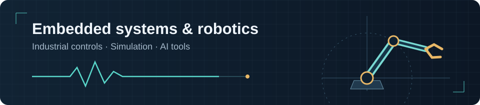

# Hi, I'm Dušan

I build embedded systems, robots, and the software around them. Here are some of my projects in controls, simulation, and AI.

[LinkedIn](https://linkedin.com/in/dusan-grkovic) · [Email](mailto:dusangrkovic2002@gmail.com) · [GitHub](https://github.com/Grkila?tab=repositories)

I spent June to August 2026 at CERN building an OPC UA PubSub publisher, PLC timing tools, and a UNICOS workbook MCP server. [Technical report](https://repository.cern/records/b6jfa-g7j31).

## Project showcase

<table>
<tr>
<td width="50%" valign="top">
<h3><a href="https://github.com/Grkila/gridlab-ev-grid-simulator">GridLab</a></h3>

EV charging scenarios, controller comparisons, and reinforcement learning on a synthetic Novi Sad grid. Built with our EV Days team.

Python · pandapower · MCP

</td>
<td width="50%" valign="top">
<h3><a href="https://github.com/Grkila/Adaptive-Gripper-with-Micro-Vibration-Based-Slip-Detection">Adaptive gripper</a></h3>
<a href="https://github.com/Grkila/Adaptive-Gripper-with-Micro-Vibration-Based-Slip-Detection"><picture><source media="(prefers-reduced-motion: reduce)" srcset="assets/gripper-still.png" /></picture></a>

My thesis: magnetic slip sensing, custom electronics, and ESP32 firmware. About 90 ms minimum reaction time.

ESP32 · FreeRTOS · FFT

</td>
</tr>
<tr>
<td width="50%" valign="top">
<h3><a href="https://github.com/Grkila/Airlock-Control-System-HIL-Testbench">Airlock testbench</a></h3>

Rover airlock firmware with a Python simulator and hardware-in-the-loop validation. Part of my NSpace work.

C++ · ESP32 · Python

</td>
<td width="50%" valign="top">
<h3><a href="https://github.com/Grkila/Serial-Two-Joint-Robot-Manipulator-Simulation-and-Control">Robot manipulator</a></h3>

A two-joint robot simulation with PID, fuzzy PID, sliding-mode control, and hand-tracking input.

LabVIEW · Python · MediaPipe

</td>
</tr>
<tr>
<td width="50%" valign="top">
<h3><a href="https://github.com/Grkila/SCADA-Industrial-Automation-Assignment">SCADA application</a></h3>

An academic monitoring application with simulated PLC data, configurable alarms, and recorded history.

C# · WPF · SQL

</td>
<td width="50%" valign="top">
<h3><a href="https://github.com/Grkila/Differential-Motion-Analyzer">Motion Analyzer</a></h3>

Desktop video analysis with motion detection, adjustable regions, and annotated video export.

Python · OpenCV · PyQt6

</td>
</tr>
<tr>
<td width="50%" valign="top">
<h3><a href="https://github.com/Grkila/gdg-accessibility-agent">SilverOne</a></h3>

Shared Android assistant project with voice input, device actions, and service fallbacks.

Java · Gemini Live · Firebase

</td>
<td width="50%" valign="top">
<h3><a href="https://github.com/Grkila/Intro-Path-Discovery">Intro Path Discovery</a></h3>

Shared AI project that finds introduction paths through connection data and ranks them with explicit scoring rules.

Python · LangGraph · Streamlit

</td>
</tr>
</table>

The gripper preview uses accelerated test footage. The two AI previews are concept diagrams. Select any card for code and project details.

**Also worth a look:** [Siemens S7 / TIA Portal](https://github.com/Grkila/Siemens-S7-Practical-Programming-Projects) · [Modbus ASCII on 8051](https://github.com/Grkila/MODBUS-for-intel-8051-microcontroller) · [ROS 2 / Docker setup](https://github.com/Grkila/Husarion-panther-sim-setup)

## A bit about me

I'm studying for an M.Sc. in Computing and Control Engineering at the University of Novi Sad. I led NSpace's embedded and robotics sub-team at ERC 2025, where we placed seventh in the Remote Formula.

My gripper thesis received a departmental nomination for the Pupin Award. I also received the Dositeja Scholarship.
