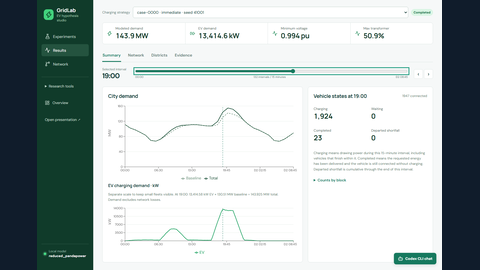
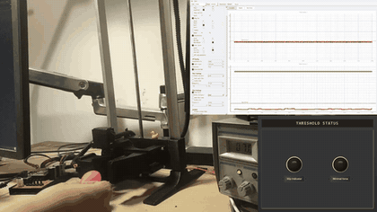
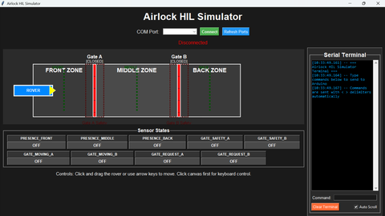
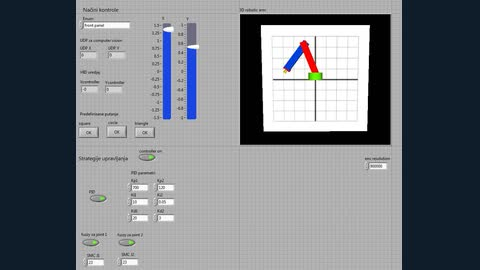
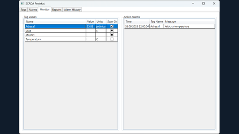
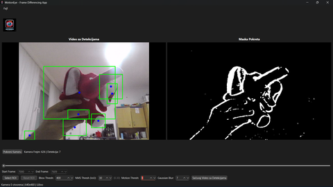
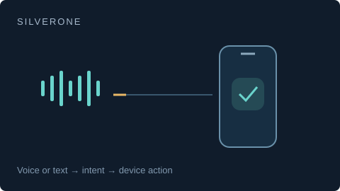
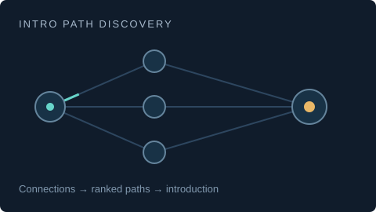

# Hi, I'm Dušan Grković

I'm an electrical and computer engineer who works across embedded systems, robotics, and industrial automation. I build firmware and electronics, then develop the software to measure, test, and control them.

My projects range from a magnetic slip-sensing gripper to EV charging simulations and AI applications. I like work where software has a clear connection to the physical system.

At CERN, I spent June to August 2026 building an OPC UA PubSub publisher, PLC timing tools, and a UNICOS workbook MCP server. My [CERN technical report](https://repository.cern/records/b6jfa-g7j31) covers the publisher.

I'm now studying for an M.Sc. in Computing and Control Engineering at the University of Novi Sad.

<strong>Show more: technologies and tools I use</strong>

These cover my independent builds, team projects, and university coursework.

| Area | Technologies and tools |
| --- | --- |
| Languages | C, C++, Python, TypeScript, Java, C#, MATLAB, Bash, VHDL, SCL, Ladder Logic |
| Embedded systems | ESP32, STM32, AT89C51RC2 / 8051, FPGA, FreeRTOS, interrupts, GPIO, PWM, ADC/DAC, bare-metal firmware |
| Industrial automation | Siemens S7-1200 / S7-1500, TIA Portal, WinCC, UNICOS-CPC / UCPC, PLC programming, SCADA |
| Control and simulation | PID, fuzzy PID, sliding-mode control, MATLAB/Simulink, LabVIEW, real-time control, system modeling, FFT, signal filtering |
| Robotics | ROS 2 Jazzy, Gazebo, NVIDIA Isaac Sim, NI sbRIO / cRIO, sensor fusion, IMU-based heading control, FOC BLDC drives |
| Communications | OPC UA PubSub / UADP, Modbus ASCII, CAN, MQTT, Ethernet, TCP/IP, UDP, Wi-Fi, Bluetooth, ESP-NOW, UART, SPI, I2C |
| Testing and measurement | HIL, SIL, Python test automation, data acquisition, live telemetry, data logging, PLC timing, JTAG, oscilloscopes, logic analyzers, Wireshark / Tshark |
| Electronics and mechanical design | Altium Designer, PCB design, LTspice, Fusion 360, AutoCAD, CAD, FDM 3D printing |
| Computer vision and data | OpenCV, MediaPipe, NumPy, Pandas, scikit-learn, Matplotlib, Seaborn, PyQt6 |
| AI and simulation projects | LangGraph, Gemini Live, MCP, Streamlit, pandapower, OpenStreetMap, Gymnasium, Stable-Baselines3, PyTorch |
| Applications and storage | WPF, MVVM, Entity Framework, SQL Server / LocalDB, SQLite, Firebase |
| Development tools | Git, GitLab, SVN, Docker, Linux, VS Code, VS Code extensions, Keil uVision, Arduino tooling, Android Studio, Quartus Prime, cloud deployment |

## Project showcase

<table>
<tr>
<td width="50%" valign="top">
<h3><a href="https://github.com/Grkila/gridlab-ev-grid-simulator">GridLab</a></h3>

EV charging scenarios, controller comparisons, and reinforcement learning on a synthetic Novi Sad grid. Built with our EV Days team.

Python · pandapower · MCP

</td>
<td width="50%" valign="top">
<h3><a href="https://github.com/Grkila/Adaptive-Gripper-with-Micro-Vibration-Based-Slip-Detection">Adaptive gripper</a></h3>
<a href="https://github.com/Grkila/Adaptive-Gripper-with-Micro-Vibration-Based-Slip-Detection"><picture><source media="(prefers-reduced-motion: reduce)" srcset="assets/gripper-still.png" /></picture></a>

My thesis: magnetic slip sensing, custom electronics, and ESP32 firmware. About 90 ms minimum reaction time.

ESP32 · FreeRTOS · FFT

</td>
</tr>
<tr>
<td width="50%" valign="top">
<h3><a href="https://github.com/Grkila/Airlock-Control-System-HIL-Testbench">Airlock testbench</a></h3>

Rover airlock firmware with a Python simulator and hardware-in-the-loop validation. Part of my NSpace work.

C++ · ESP32 · Python

</td>
<td width="50%" valign="top">
<h3><a href="https://github.com/Grkila/Serial-Two-Joint-Robot-Manipulator-Simulation-and-Control">Robot manipulator</a></h3>

A two-joint robot simulation with PID, fuzzy PID, sliding-mode control, and hand-tracking input.

LabVIEW · Python · MediaPipe

</td>
</tr>
<tr>
<td width="50%" valign="top">
<h3><a href="https://github.com/Grkila/SCADA-Industrial-Automation-Assignment">SCADA application</a></h3>

An academic monitoring application with simulated PLC data, configurable alarms, and recorded history.

C# · WPF · SQL

</td>
<td width="50%" valign="top">
<h3><a href="https://github.com/Grkila/Differential-Motion-Analyzer">Motion Analyzer</a></h3>

Desktop video analysis with motion detection, adjustable regions, and annotated video export.

Python · OpenCV · PyQt6

</td>
</tr>
<tr>
<td width="50%" valign="top">
<h3><a href="https://github.com/Grkila/gdg-accessibility-agent">SilverOne</a></h3>

Shared Android assistant project with voice input, device actions, and service fallbacks.

Java · Gemini Live · Firebase

</td>
<td width="50%" valign="top">
<h3><a href="https://github.com/Grkila/Intro-Path-Discovery">Intro Path Discovery</a></h3>

Shared AI project that finds introduction paths through connection data and ranks them with explicit scoring rules.

Python · LangGraph · Streamlit

</td>
</tr>
</table>

The gripper preview uses accelerated test footage. The two AI previews are concept diagrams. Select any card for code and project details.

### More projects

## A bit about me

I led NSpace's embedded and robotics sub-team at ERC 2025, where we placed seventh in the Remote Formula.

My gripper thesis received a departmental nomination for the Pupin Award. I also received the Dositeja Scholarship.
